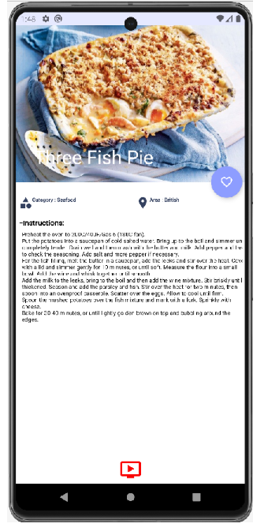

# Recipes App (Kotlin, Android)

An Android recipes application built during my Computer Science degree.  
The app lets users browse, search, and view recipes with full details.

---

## ✨ Features
- Browse and search recipes by name or category  
- Recipe details screen (ingredients, instructions, image)  
- Save favorite recipes  
- Smooth navigation between screens  

---

## 🛠️ Tech Stack
- **Language:** Kotlin  
- **Architecture:** (MVVM / MVC — specify what you used)  
- **Libraries:** (Room, Retrofit, Coroutines, Jetpack Navigation, etc.)  

---

## 📸 Screenshots

  
  
  

  
  
  

  
  
  

---

## 🚀 How to Run
1. Clone the repository:  
   git clone https://github.com/michalrolnik/recipes-app.git
2. Open the project in Android Studio
3. Run on an emulator or physical device

👩‍💻 Author
Developed by Michal Rolnik as part of my Computer Science degree.

